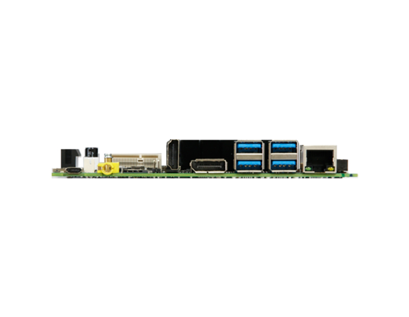
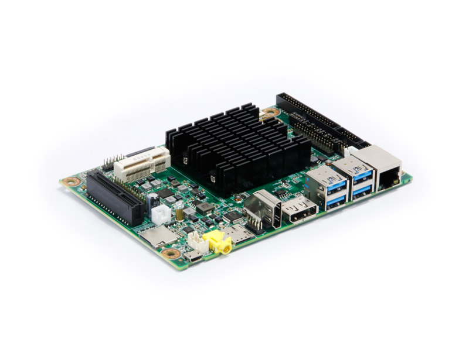

# 华北工控EMB3531

## 规格

---

## 尺寸图

---

## 相关站点

* 官网： <http://www.norco.com.cn/product_detail_359.html>
* 垃圾佬论坛固件下载：<https://files.kos.org.cn/rockchip/EMB3531/>
* ophub: <https://github.com/ophub/amlogic-s9xxx-armbian/issues/1549>
* openhub fnos: <https://github.com/ophub/fnnas/releases>
* 拆箱视频: <https://www.bilibili.com/video/BV1Ve2fYmEqd>
* ophub 适配申请: <https://github.com/ophub/amlogic-s9xxx-armbian/issues/1549>
* emb3531 dts补丁: <https://github.com/bk3a12/emb3531/tree/main>
* 《入手华北工控RK3399板子(盒子)
  型号EMB-3531值得一玩》: <https://www.right.com.cn/forum/thread-8251255-1-1.html>

---

## 目录

* [开发板信息](docs/开发板信息/开发板信息.md)
* [刷机指引](docs/刷机指引/刷机指引.md)
* [官方源代码](docs/官方源代码/官方源代码.md)
* [固件适配情况](docs/固件适配情况/固件适配情况.md)
* [PCIE接口使用](docs/PCIE接口使用/PCIE接口使用.md)

---

## 相关照片

---
