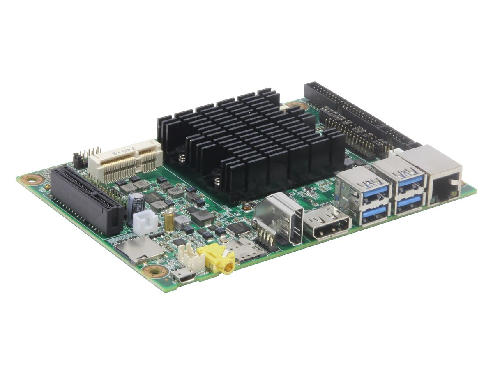
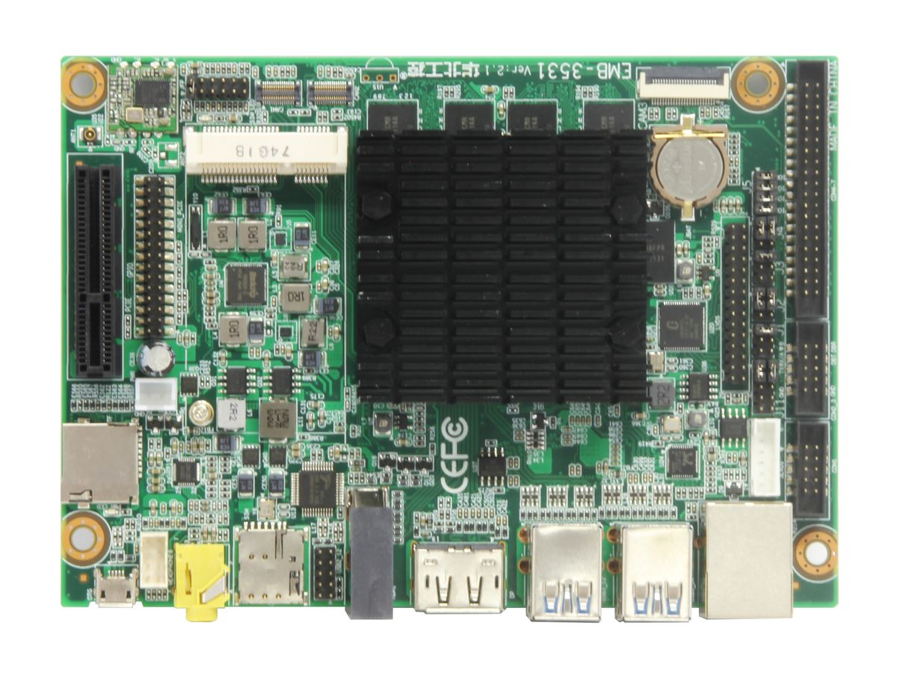
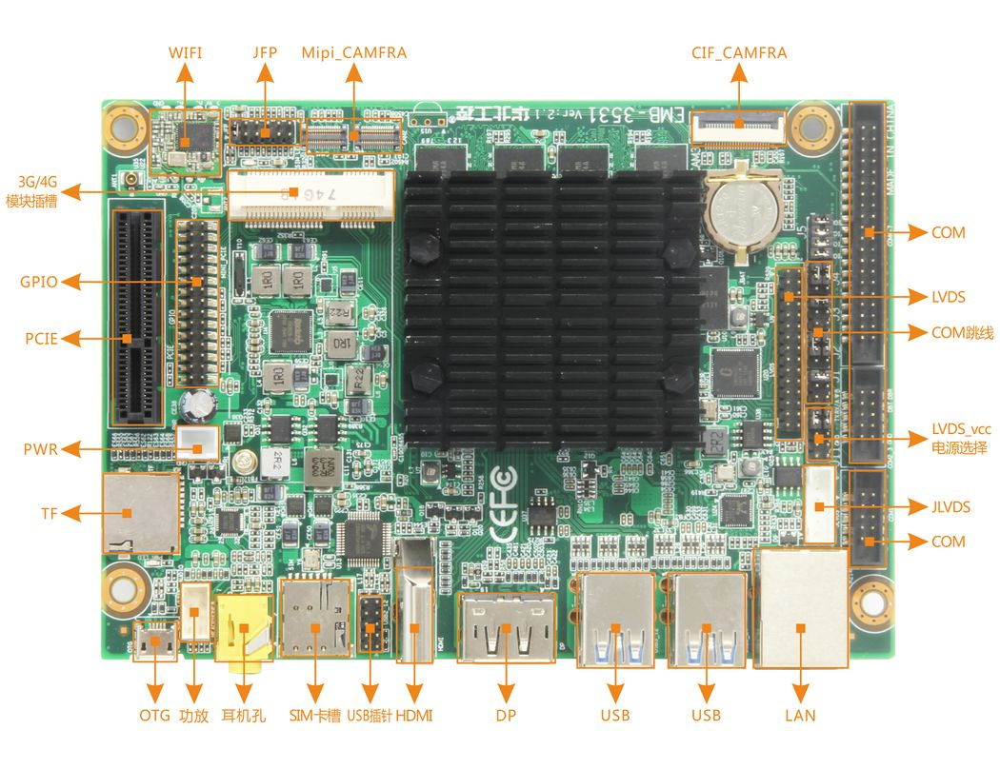
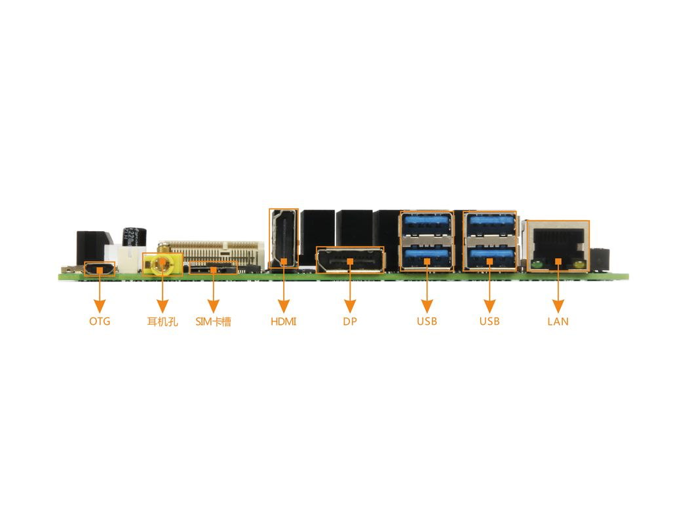
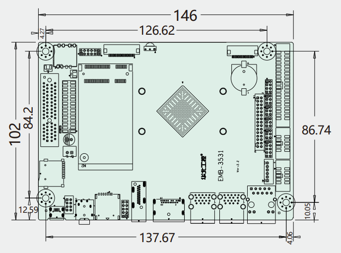
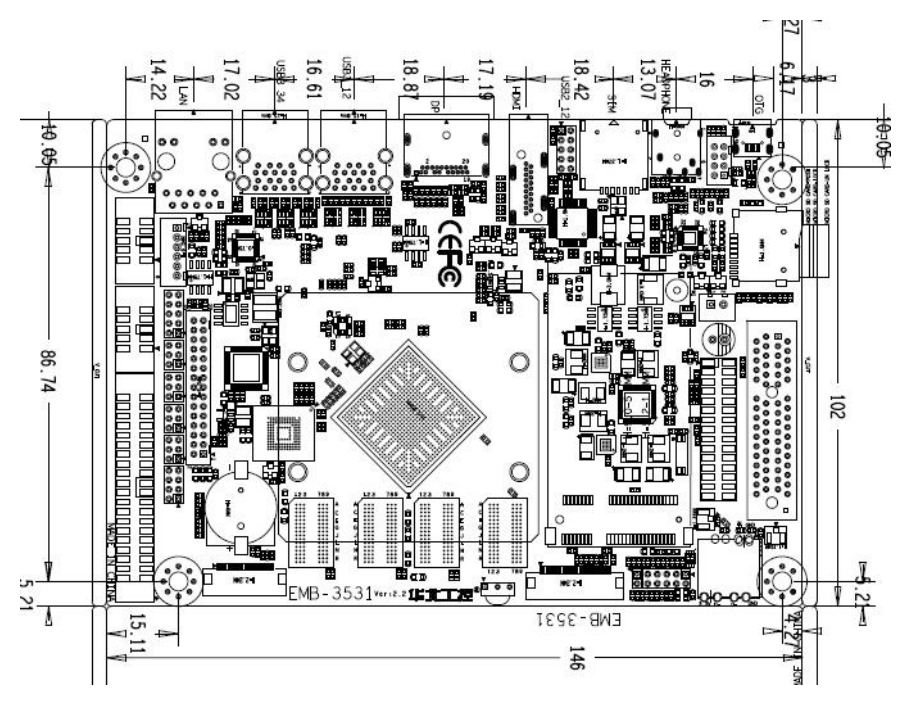
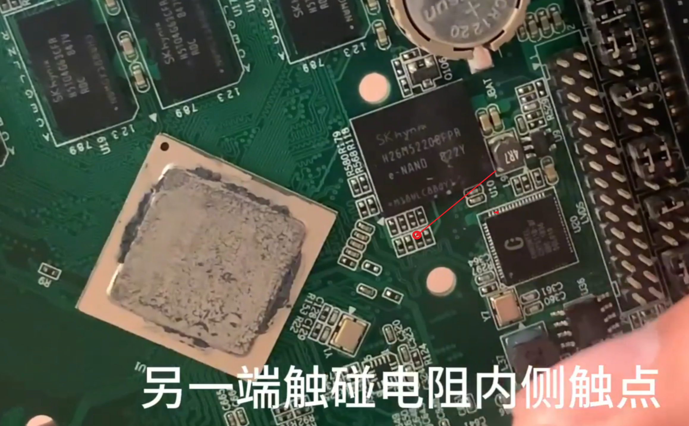
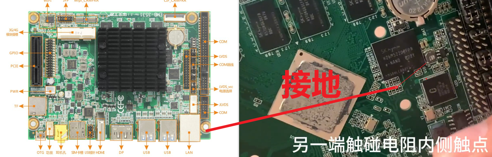
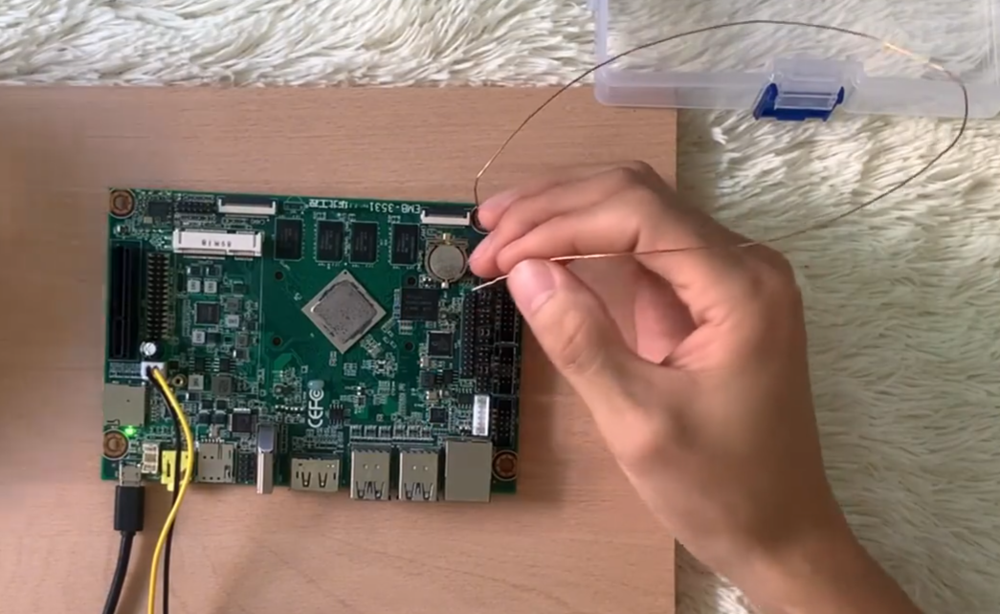

# 华北工控EMB3531





## 规格

* CPU：Rcokchip RK3399(双核A72 2GHz+四核 A53 1.5GHz)
* GPU：Mali-T864
* DDR3 RAM：最大4GB
* Ethernet: 10/100/1000M 以太网口, 采用RTL8211F
* Wireless/蓝牙：RTL8188ETV（可选蓝牙WIFI一体模块）
* 4G：1 x MINI PCIe
* Audio：板载ES8316+NS4258T（1 x HeadPhone(支持4节),2 x Mic,板载5W双输出功放)
* Storage：最大64G Flash
* MicroSD Slot：x1
* USB Host： 4x USB3.0，3x USB2.0，1x USB OTG
* COM： 6x COM（4x RS232/TTL，2x COM485/232/TTL）,1x DB9调试接口
* Display：1 x HDMI ,1 x LVDS ，1 x DP
* Other I/O：3x Camera(24 pin FPC)，30PIN GPIO 接口[可配置SPI,I2S,MIPI,I2C]，1x PCIE X4
* System Control：Reset switch, Power switch
* Temperature：Work -20 ~ 65, Storage -40 ~ 85
* Humidity：5% ~ 95%相对湿度，无冷凝
* PCB Size: 146 x 102 mm
* Power Supply: DC 12V
* OS: Android , Linux
* Other：Watchdog, RTC

---

## 接口概览





## 尺寸图




---

## 相关站点

* [官网](http://www.norco.com.cn/product_detail_359.html)
* [官方WIKI](http://norcord.com:8070/d/34131f775091442d9fdc/)
* [垃圾佬论坛固件下载](https://files.kos.org.cn/rockchip/EMB3531/)
* [ophub for EMB3531](https://github.com/ophub/amlogic-s9xxx-armbian/issues/1549)
* [openhub fnos for EMB3531](https://github.com/ophub/fnnas/releases)
* [拆箱视频](https://www.bilibili.com/video/BV1Ve2fYmEqd)
* [ophub 适配申请](https://github.com/ophub/amlogic-s9xxx-armbian/issues/1549)
* [emb3531 dts补丁](https://github.com/bk3a12/emb3531/tree/main)
* [入手华北工控RK3399板子(盒子)型号EMB-3531值得一玩](https://www.right.com.cn/forum/thread-8251255-1-1.html)

---

## 目录

* [开发板信息](docs/开发板信息/开发板信息.md)
* [刷机指引](docs/刷机指引/刷机指引.md)
* [官方固件](docs/官方固件/官方固件.md)
* [固件适配情况](docs/固件适配情况/固件适配情况.md)
* [官方debian9系统](docs/固件适配情况/官方debian9系统.md)
* [PCIE接口使用](docs/PCIE接口使用/PCIE接口使用.md)
* [TTL调试](docs/TTL调试/TTL调试.md)
* [接口引脚定义](docs/接口引脚定义/接口引脚定义.md)
* [相关图片](docs/相关图片/相关图片.md)

---

## 12V电源接口


## TTL连接方式


将COM设备与板卡连接，确认连接无误后开机（连接方法参照上文[接口引脚定义]并注意232/485模式的选择） 确认所连接的节点

EMB-3531 串口节点如下:

* COM1-----/dev/ttyS0
* COM2-----调试口
* COM3-----/dev/ttyS1
* COM4-----/dev/ttyVIZ0
* COM5-----/dev/ttyVIZ1
* COM6-----/dev/ttyVIZ2
* COM7-----/dev/ttyVIZ3


```shell
 波特率：115200
 数据位：8
 停止位：1
 奇偶校验：无
 流控：无
   ```


## 进入maskrom方式

方式一：







短接点和金属接地段。

参看视频：[华北工控EMB3531 (RK3399)拆机测试](https://www.bilibili.com/video/BV1Ve2fYmEqd)

方式二：


---


## uboot命令行引导系统

```shell
ext4load mmc 0:3 0x02000000 vmlinuz-6.6-kdev

ext4load mmc 0:3 0x01f00000 /dtb/rk3399-emb3531.dtb

setenv bootargs 'root=/dev/mmcblk0p4 rootwait rw console=ttyS2,115200 cgroup_enable=cpuset cgroup_memory=1 cgroup_enable=memory net.ifnames=0 biosdevname=0 level=10 loglevel=10 selinux=0 crashkernel=384M-:128M systemd.mask=systemd-growfs@-.service rockchip.dmc_freq=528000 video=HDMI-A-1:1920x1080@60'

booti 0x02000000 - 0x01f00000
```


