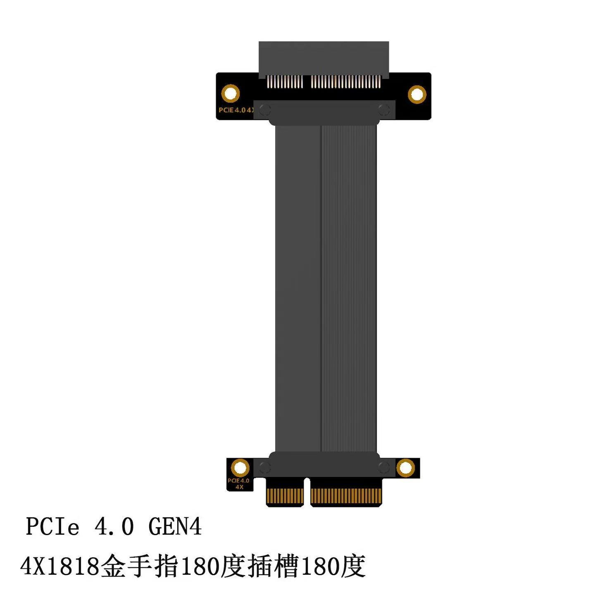
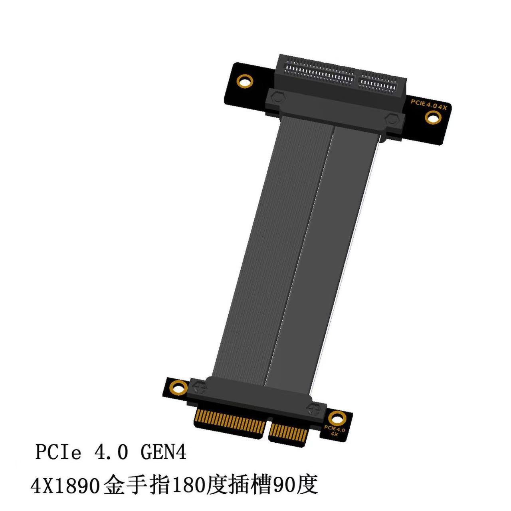
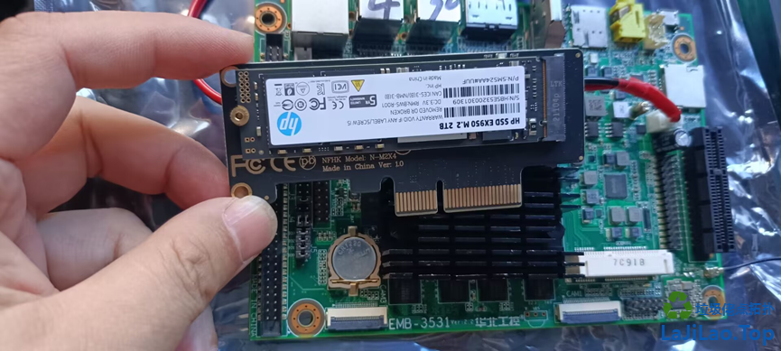
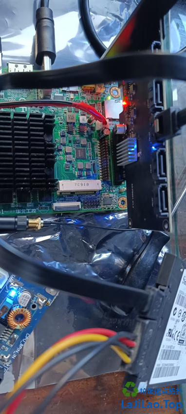
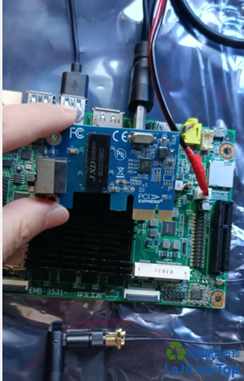
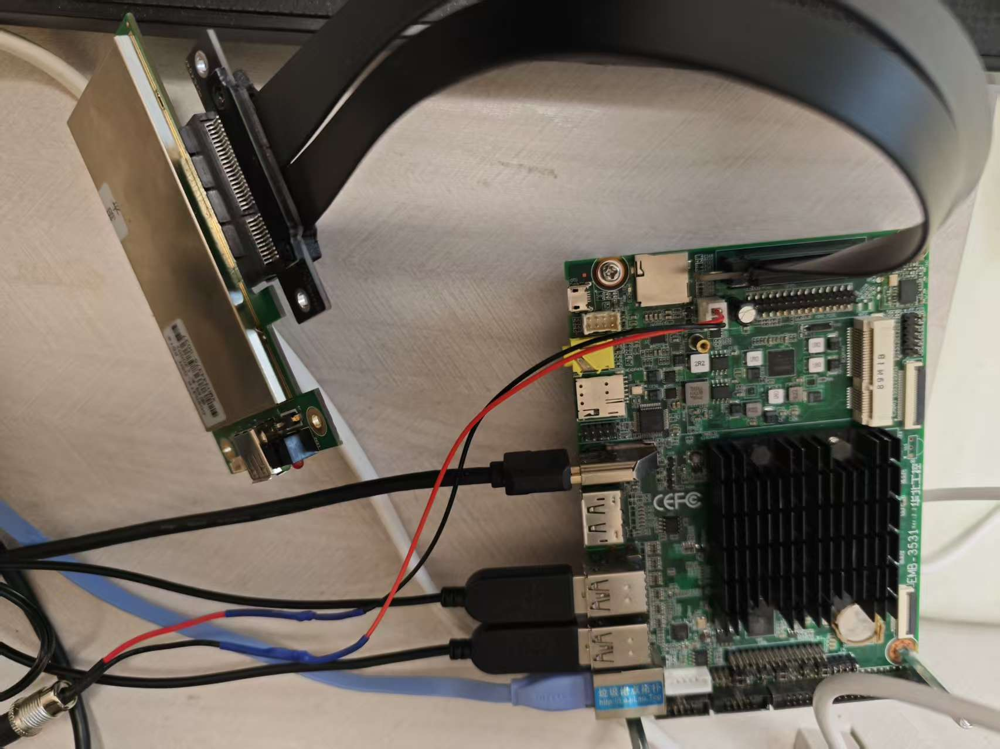

# PCIE接口使用

## PCIE延长线

PCI-E4.04X转8X16X网卡硬盘扩展卡支持服务器固态高效延长线

---

## PCIE支持情况

* 参考：<https://lajilao.top/thread-79-1-1.html>

1.使用PCIE转M2,HP 2T硬盘正常识别

2.使用PCIE转SATA,硬盘不识别。如图：

3.扩展网卡不认识

4. 扩展密码卡-可识别

---

## PCIE供电问题

