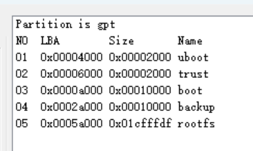
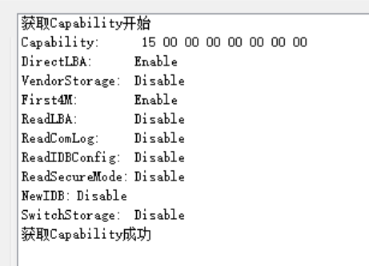
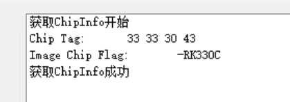
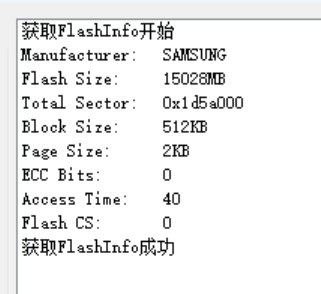
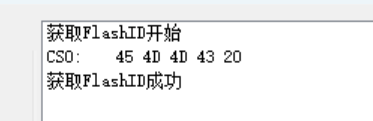
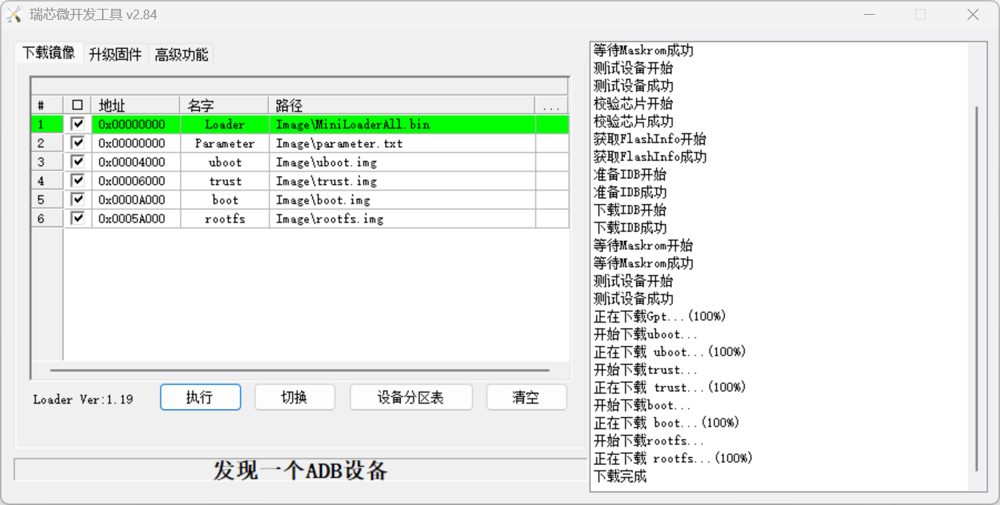
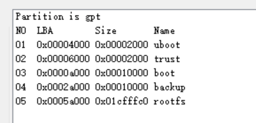

# 官方固件

## RK3399-EMB-3531-V2.2-Linux-General-debian_base-armhf_20200423.img

```text

md5sum 

749d7ab255c6de4c9712e0ab99056388 *RK3399-EMB-3531-V2.2-Linux-General-debian_base-armhf_20200423.img

```












parameter.txt: 
```text

FIRMWARE_VER: 8.1
MACHINE_MODEL: RK3399
MACHINE_ID: 007
MANUFACTURER: RK3399
MAGIC: 0x5041524B
ATAG: 0x00200800
MACHINE: 3399
CHECK_MASK: 0x80
PWR_HLD: 0,0,A,0,1
TYPE: GPT
CMDLINE: mtdparts=rk29xxnand:0x00002000@0x00004000(uboot),0x00002000@0x00006000(trust),0x00010000@0x0000a000(boot),0x00010000@0x0002a000(backup),-@0x0005a000(rootfs:grow)
uuid:rootfs=614e0000-0000-4b53-8000-1d28000054a9
```



backup分区可选，不一定非要

### 系统信息

```shell
root@linaro-alip:~# lsblk
NAME         MAJ:MIN RM  SIZE RO TYPE MOUNTPOINT
mmcblk1      179:0    0 14.7G  0 disk 
├─mmcblk1p1  179:1    0    4M  0 part 
├─mmcblk1p2  179:2    0    4M  0 part 
├─mmcblk1p3  179:3    0   32M  0 part 
├─mmcblk1p4  179:4    0   32M  0 part 
└─mmcblk1p5  179:5    0 14.5G  0 part /
mmcblk1boot0 179:32   0    4M  1 disk 
mmcblk1boot1 179:64   0    4M  1 disk 
mmcblk1rpmb  179:96   0    4M  0 disk 
root@linaro-alip:~# uname -a
Linux linaro-alip 4.4.179 #1 SMP Wed Apr 22 17:35:44 CST 2020 aarch64 GNU/Linux
root@linaro-alip:~# blkid
/dev/mmcblk1: PTUUID="b8240000-0000-4165-8000-1e0f0000489c" PTTYPE="gpt"
/dev/mmcblk1p1: PARTLABEL="uboot" PARTUUID="b70f0000-0000-4f18-8000-4a1f000062ec"
/dev/mmcblk1p2: PARTLABEL="trust" PARTUUID="36570000-0000-4e70-8000-45e10000557e"
/dev/mmcblk1p3: PARTLABEL="boot" PARTUUID="7c260000-0000-4652-8000-569d00006e1b"
/dev/mmcblk1p4: PARTLABEL="backup" PARTUUID="d34e0000-0000-4e06-8000-649b00005f8b"
/dev/mmcblk1p5: UUID="84b183c8-8a05-4e46-985a-65056190c068" TYPE="ext4" PARTLABEL="rootfs" PARTUUID="614e0000-0000-4b53-8000-1d28000054a9"
root@linaro-alip:~# cat /etc/os-release 
PRETTY_NAME="Debian GNU/Linux 9 (stretch)"
NAME="Debian GNU/Linux"
VERSION_ID="9"
VERSION="9 (stretch)"
ID=debian
HOME_URL="https://www.debian.org/"
SUPPORT_URL="https://www.debian.org/support"
BUG_REPORT_URL="https://bugs.debian.org/"
root@linaro-alip:~# ip a
1: lo: <LOOPBACK,UP,LOWER_UP> mtu 65536 qdisc noqueue state UNKNOWN group default qlen 1
    link/loopback 00:00:00:00:00:00 brd 00:00:00:00:00:00
    inet 127.0.0.1/8 scope host lo
       valid_lft forever preferred_lft forever
    inet6 ::1/128 scope host 
       valid_lft forever preferred_lft forever
2: eth0: <NO-CARRIER,BROADCAST,MULTICAST,UP> mtu 1500 qdisc pfifo_fast state DOWN group default qlen 1000
    link/ether 22:3e:7b:65:64:4b brd ff:ff:ff:ff:ff:ff
3: wlan0: <NO-CARRIER,BROADCAST,MULTICAST,UP> mtu 1500 qdisc mq state DOWN group default qlen 1000
    link/ether d4:b7:61:7b:80:59 brd ff:ff:ff:ff:ff:ff
4: p2p0: <NO-CARRIER,BROADCAST,MULTICAST,UP> mtu 1500 qdisc mq state DOWN group default qlen 1000
    link/ether d6:b7:61:7b:80:59 brd ff:ff:ff:ff:ff:ff

```


## RK3399-EMB-3531-V2.2-Linux-General-ubuntu18.04_terminal-armhf_20200423

```shell
apt-get update

apt-get install -y vim lrzsz tmux build-essential pciutils

```




### 系统信息


默认只有root用户，开放22端口，但是禁止root登陆

```shell

root@norco:~# ip a
1: lo: <LOOPBACK,UP,LOWER_UP> mtu 65536 qdisc noqueue state UNKNOWN group default qlen 1
    link/loopback 00:00:00:00:00:00 brd 00:00:00:00:00:00
    inet 127.0.0.1/8 scope host lo
       valid_lft forever preferred_lft forever
    inet6 ::1/128 scope host 
       valid_lft forever preferred_lft forever
2: eth0: <BROADCAST,MULTICAST,UP,LOWER_UP> mtu 1500 qdisc pfifo_fast state UP group default qlen 1000
    link/ether 22:3e:7b:65:64:4b brd ff:ff:ff:ff:ff:ff
    inet 192.168.33.193/24 brd 192.168.33.255 scope global eth0
       valid_lft forever preferred_lft forever
    inet6 fe80::203e:7bff:fe65:644b/64 scope link 
       valid_lft forever preferred_lft forever
3: wlan0: <NO-CARRIER,BROADCAST,MULTICAST,UP> mtu 1500 qdisc mq state DOWN group default qlen 1000
    link/ether d4:b7:61:7b:80:59 brd ff:ff:ff:ff:ff:ff
4: p2p0: <NO-CARRIER,BROADCAST,MULTICAST,UP> mtu 1500 qdisc mq state DOWN group default qlen 1000
    link/ether d6:b7:61:7b:80:59 brd ff:ff:ff:ff:ff:ff
root@norco:~# 
root@norco:~# uname -a
Linux norco 4.4.179 #1 SMP Wed Apr 22 17:35:44 CST 2020 aarch64 aarch64 aarch64 GNU/Linux
root@norco:~# 
root@norco:~# 
root@norco:~# lsblk
NAME         MAJ:MIN RM  SIZE RO TYPE MOUNTPOINT
mmcblk1      179:0    0 14.7G  0 disk 
|-mmcblk1p1  179:1    0    4M  0 part 
|-mmcblk1p2  179:2    0    4M  0 part 
|-mmcblk1p3  179:3    0   32M  0 part 
|-mmcblk1p4  179:4    0   32M  0 part 
`-mmcblk1p5  179:5    0 14.5G  0 part /
mmcblk1boot0 179:32   0    4M  1 disk 
mmcblk1boot1 179:64   0    4M  1 disk 
mmcblk1rpmb  179:96   0    4M  0 disk 
root@norco:~# 
root@norco:~# blkid
/dev/mmcblk1: PTUUID="b1290000-0000-4a3d-8000-505f0000389d" PTTYPE="gpt"
/dev/mmcblk1p1: PARTLABEL="uboot" PARTUUID="46290000-0000-4053-8000-426f0000529c"
/dev/mmcblk1p2: PARTLABEL="trust" PARTUUID="2c220000-0000-4f17-8000-7e7300004c98"
/dev/mmcblk1p3: PARTLABEL="boot" PARTUUID="6b4a0000-0000-4134-8000-097100006f18"
/dev/mmcblk1p4: PARTLABEL="backup" PARTUUID="0c580000-0000-4e17-8000-6e7400004aa4"
/dev/mmcblk1p5: UUID="59f19875-eedd-4f8b-ae89-a0afa438b7c1" TYPE="ext4" PARTLABEL="rootfs" PARTUUID="614e0000-0000-4b53-8000-1d28000054a9"
root@norco:~# 
root@norco:~# 
root@norco:~# cat /etc/os-release 
NAME="Ubuntu"
VERSION="18.04.1 LTS (Bionic Beaver)"
ID=ubuntu
ID_LIKE=debian
PRETTY_NAME="Ubuntu 18.04.1 LTS"
VERSION_ID="18.04"
HOME_URL="https://www.ubuntu.com/"
SUPPORT_URL="https://help.ubuntu.com/"
BUG_REPORT_URL="https://bugs.launchpad.net/ubuntu/"
PRIVACY_POLICY_URL="https://www.ubuntu.com/legal/terms-and-policies/privacy-policy"
VERSION_CODENAME=bionic
UBUNTU_CODENAME=bionic
root@norco:~# 
root@norco:~# 

root@norco:/etc/apt# dmesg |grep -i pci
                   PCI I/O : 0xffffffbffee00000 - 0xffffffbfffe00000   (    16 MB)
[    0.190053] PCI/MSI: /interrupt-controller@fee00000/interrupt-controller@fee20000 domain created
[    0.827464] PCI: CLS 0 bytes, default 64
[    0.957264] phy phy-pcie-phy.7: Looking up phy-supply from device tree
[    0.957276] phy phy-pcie-phy.7: Looking up phy-supply property in node /pcie-phy failed
[    1.411149] rockchip-pcie f8000000.pcie: GPIO lookup for consumer ep
[    1.411166] rockchip-pcie f8000000.pcie: using device tree for GPIO lookup
[    1.411208] of_get_named_gpiod_flags: parsed 'ep-gpios' property of node '/pcie@f8000000[0]' - status (0)
[    1.411566] rockchip-pcie f8000000.pcie: Looking up vpcie3v3-supply from device tree
[    1.411583] rockchip-pcie f8000000.pcie: Looking up vpcie3v3-supply property in node /pcie@f8000000 failed
[    1.411605] rockchip-pcie f8000000.pcie: no vpcie3v3 regulator found
[    1.417983] rockchip-pcie f8000000.pcie: Looking up vpcie1v8-supply from device tree
[    1.417999] rockchip-pcie f8000000.pcie: Looking up vpcie1v8-supply property in node /pcie@f8000000 failed
[    1.418015] rockchip-pcie f8000000.pcie: no vpcie1v8 regulator found
[    1.424387] rockchip-pcie f8000000.pcie: Looking up vpcie0v9-supply from device tree
[    1.424403] rockchip-pcie f8000000.pcie: Looking up vpcie0v9-supply property in node /pcie@f8000000 failed
[    1.424418] rockchip-pcie f8000000.pcie: no vpcie0v9 regulator found
[    1.430790] rockchip-pcie f8000000.pcie: missing "memory-region" property
[    1.437603] PCI host bridge /pcie@f8000000 ranges:
[    1.506658] rockchip-pcie f8000000.pcie: PCI host bridge to bus 0000:00
[    1.513295] pci_bus 0000:00: root bus resource [bus 00-1f]
[    1.518803] pci_bus 0000:00: root bus resource [mem 0xfa000000-0xfbdfffff]
[    1.525696] pci_bus 0000:00: root bus resource [io  0x0000-0xfffff] (bus address [0xfbe00000-0xfbefffff])
[    1.535310] pci 0000:00:00.0: [1d87:0024] type 01 class 0x060400
[    1.535420] pci 0000:00:00.0: supports D1
[    1.535433] pci 0000:00:00.0: PME# supported from D0 D1 D3hot
[    1.535748] pci 0000:00:00.0: bridge configuration invalid ([bus 00-00]), reconfiguring
[    1.555067] pci 0000:01:00.0: [9000:1003] type 00 class 0x058000
[    1.580485] pci 0000:01:00.0: reg 0x10: [mem 0x00000000-0x000fffff 64bit]
[    1.585589] pci 0000:01:00.0: reg 0x18: [mem 0x00000000-0x000fffff]
[    1.590692] pci 0000:01:00.0: reg 0x1c: [mem 0x00000000-0x0000ffff]
[    1.595795] pci 0000:01:00.0: reg 0x20: [mem 0x00000000-0x00000fff]
[    1.600898] pci 0000:01:00.0: reg 0x24: [mem 0x00000000-0x0000ffff]
[    1.606002] pci 0000:01:00.0: reg 0x30: [mem 0x00000000-0x007fffff pref]
[    1.631461] pci 0000:01:00.0: supports D1
[    1.631476] pci 0000:01:00.0: PME# supported from D0 D1 D3hot
[    1.655318] pci_bus 0000:01: busn_res: [bus 01-1f] end is updated to 01
[    1.655358] pci 0000:00:00.0: BAR 8: assigned [mem 0xfa000000-0xfabfffff]
[    1.662161] pci 0000:01:00.0: BAR 6: assigned [mem 0xfa000000-0xfa7fffff pref]
[    1.669394] pci 0000:01:00.0: BAR 0: assigned [mem 0xfa800000-0xfa8fffff 64bit]
[    1.683789] pci 0000:01:00.0: BAR 2: assigned [mem 0xfa900000-0xfa9fffff]
[    1.692605] pci 0000:01:00.0: BAR 3: assigned [mem 0xfaa00000-0xfaa0ffff]
[    1.701423] pci 0000:01:00.0: BAR 5: assigned [mem 0xfaa10000-0xfaa1ffff]
[    1.710246] pci 0000:01:00.0: BAR 4: assigned [mem 0xfaa20000-0xfaa20fff]
[    1.719065] pci 0000:00:00.0: PCI bridge to [bus 01]
[    1.724040] pci 0000:00:00.0:   bridge window [mem 0xfa000000-0xfabfffff]
[    1.730887] pcieport 0000:00:00.0: enabling device (0000 -> 0002)
[    1.737250] pcieport 0000:00:00.0: Signaling PME through PCIe PME interrupt
[    1.744214] pci 0000:01:00.0: Signaling PME through PCIe PME interrupt
[    1.750745] pcie_pme 0000:00:00.0:pcie01: service driver pcie_pme loaded
[    1.750859] aer 0000:00:00.0:pcie02: service driver aer loaded
[    2.221946] ehci-pci: EHCI PCI platform driver
root@norco:/etc/apt# 
root@norco:/etc/apt# 


```

